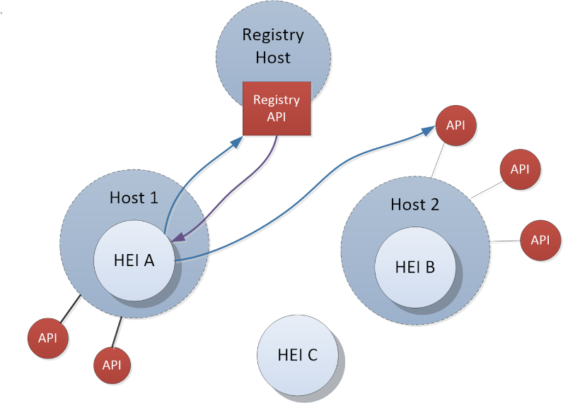

EWP Architecture
================

This document describes EWP Network components, establishes some common
security measures, features, data types and vocabulary, and explains how
partners communicate with themselves. It also describes one of the components
in detail - **the EWP Registry**.

* [What is the status of this document?][statuses]
* [See the index of all other EWP Specifications][develhub]

How to join the EWP Network?
----------------------------

### Quick start

In order to join our network you'll need to:

 * Publish a valid [Discovery Manifest][discovery-api] somewhere on your
   servers.

 * Send the URL of your manifest to the EWP Registry maintainers. It will be
   stored in the EWP Partners Registry, allowing other partners to identify and
   verify your future requests.

### Implementing APIs

Having completed the two steps described above, you will become a member of the
EWP Network, and you will be able to issue requests to other EWP members
(retrieve information from **other** institutions). You will NOT however share
any of **your** data yet - you'll need to implement some more APIs to do that.

For a complete list of APIs - see the [Discovery API documentation]
[discovery-api].

The EWP Registry
----------------

### Summary

The registry is the only centralized part of the EWP architecture. It allows
all EWP hosts to access the list of other EWP hosts. (It MAY also be used for
projects unrelated to EWP, as long as these projects will be mentioned in the
Discovery API documentation.)

### How is it updated?

The registry is being updated **automatically**. It MUSTs periodically read all
the information which all the hosts provide within their [Discovery Manifest
files][discovery-api], and these changes MUST be reflected in the registry
response.

The major advantage of such automatic updating is that all the partners *do not
need* to contact the registry maintainer in order to change their Registry
entries. Many operations (such as changing the server certificate, or adding a
new HEI to a host) can be performed simply by updating the manifest on **the
partner's** server (and the Registry will fetch these changes automatically).

### Requirements for the Clients

 * All clients SHOULD cache the registry responses. (Note, that all APIs SHOULD
   be backward compatible after they are deployed onto production systems, so
   caching API version numbers is quite safe).

 * The clients MAY use the HTTP headers returned in the Registry response to
   determine the amount of time the Registry response should be cached. They
   also MAY choose their own constant value for such expiry, but it MUST NOT be
   greater than 12 hours.

 * The clients MAY keep the cached copy of the Registry as a backup. E.g. if
   the Registry Server cannot be contacted for some reason, a stale cached copy
   may be used instead.

### Requirements for the Server

 * The Registry response MUST be accompanied by a proper HTTP `Cache-Control`
   and `Expires` headers.

 * The Registry Server MUST follow the *Host->Host* security policy (described
   below) when accessing the manifest files, that is, it MUST access these
   manifests with HTTPS protocol and require them to be signed using one of
   the *previously* known certificates (see also the [updating certificates]
   (https://github.com/erasmus-without-paper/ewp-specs-api-discovery/blob/master/README.md#updating-certificates)
   section of the Discovery Manifest specification).

 * The Registry Server SHOULD validate manifest files before importing them.
   If the manifest fails validation, the server SHOULD notify the administrator
   of the host which serves the invalid manifest OR a human maintainer of the
   Registry Server, so that the problem will be noticed.

 * The Registry MUST recognize and support the latest version of the
   Manifest file (immediatelly after it is released).

### Response format

The Registry service takes no parameters. It simply returns a "static"
response at the proper URL.

The response MUST conform to the XML Schema provided in the attached
[registry.xsd](registry.xsd) file. See [registry-example.xml]
(registry-example.xml) for an example of a valid registry response.

### Location

*WRTODO: To be determined.*

<!-- WRTODO: include registry certificate here -->
<!-- WRTODO: Backup domain? -->

Hosts, APIs and other components
--------------------------------

### HEIs

HEI is an acronym for **Higher Education Institution**. The EWP Project aims on
allowing communication between them.

### EWP Hosts

In order for the HEI to benefit from the EWP Project, it needs to be placed
within an EWP Host.

 * EWP Hosts are *groups of HEIs*. Host 1 **covers** institutions A, B and C,
   while institution D is **being covered** by Host 2. Institution E is not
   covered by any host within the EWP network.

 * One HEI SHOULD be covered by no more than one EWP Host.

 * In some countries, there will be only a single EWP Host per country. In
   other countries every HEI will run its own EWP Host.

### Registry

We'll try to imagine an example request within the EWP Network. Let's say that
HEI B wants to fetch some student data from the EWP Network.

 * HEI B **knows** the ID of the student, and it knows the ID of the home
   institution of this student. So it knows which HEI it wants to fetch the
   data *from* (let's say it's HEI D).

 * HEI B asks *its own* EWP Host (Host 1) to fetch the data it needs from the
   EWP Network.

 * Host 1 **does not know** which of the EWP Hosts **covers** HEI D. It doesn't
   even know if HEI D is *being covered* in the EWP Network.

 * Host 1 calls the EWP Registry Service. The Registry Service keeps track of
   all the EWP Hosts and of all the HEIs covered by them. Given the Registry
   response, Host 1 is now able to determine that it needs to contact Host 2 in
   order to get the data.

### APIs

EWP Hosts are **not required** to implement *all* features of the EWP Network.
Host 2 covers HEI D, but this **does not necessarily mean** that Host 2 has
implemented the API needed (or specific API *version* needed) by Host 1 in
order to fetch the student data it needs.

In order to avoid unnecessary requests, The Registry Service keeps track of all
the implemented APIs too. Host 1 will be able to verify if the specific API has
been implemented, and retrieve its URL from the Registry.

### Push notifications (and broadcasting)

What if HEI B wanted to **notify** HEI D about something, instead of fetching
the data from it? E.g. a student has just failed an exam at B and we suspect
that D would want to know it?

Some of the APIs are **event listener APIs**. If Host 2 wants to receive such
notifications from other hosts, he indicates that he has implemented a specific
event listener API in its Manifest file. Now, if Host 1 is able to broadcast
such notifications, then it asks the Registry which hosts have implemented the
proper listeners, and posts the proper notifications at the listener URLs.

It's worth noting that Host 1 is NOT REQUIRED to be able to broadcast such
notifications (even if all other hosts implement listeners). Implementers MAY
choose to implement only a subset of push notifications, or even not implement
them at all. You will find more information on this in the documentation of
specific event listener APIs.

<!-- WRTODO: Examples of such APIs. -->

Security
--------

### SSL Certificates

Each EWP Host declares a list of X.509 Certificates which it will use for
communication with other hosts (it does so be including them in its Manifest
file). The list MUST contain at least one certificate (and often will contain
just one), but it MAY contain an unlimited number of them.

The list of all certificates in use can be acquired from the EWP Registry.

### Should I verify *all* requests?

No.

EWP Hosts MAY use the certificates provided by the Registry to verify if the
request came from within the EWP Network, but *in some cases* they SHOULD NOT
deny access to requests from *outside* the network.

Every API defines its own security requirements. In most cases it *will* be
REQUIRED for the EWP Host to verify its requester, but in some other cases
(e.g. the Discovery Manifest API) it will be the opposite - some requests MUST
be allowed to be performed by **anonymous** requesters.

### Should I verify *all* responses?

Yes - it is RECOMMENDED for all EWP Clients to verify that the response comes
from a trusted source.

### Popular Security Policies

Hereby we define some basic terms which describe some common security policies
used within the API specifications.

These policies should be sufficient for most of the APIs. You will need to
consult the documentation of a specific API in order to determine which
security policy is required in which case.

 * **Anonymous->Host**: The request can be made by anyone, e.g. via a web
   browser. The client (requester) does not need to use any SSL certificate.

 * **Network->Host**: Access from within the EWP Network. Client certificate is
   required. The server needs to verify if the client request was signed by ANY
   of the certificates listed in the EWP Registry (all EWP Hosts can access
   this resource).

 * **Host->Host**: Access to a specific EWP Host. Requests MUST be signed by a
   certificate of a single, specific EWP Host. Other EWP Hosts MUST NOT be able
   to access the resource.

Backward-compatibility rules
----------------------------

All implementers and API designers MUST follow the following basic rules when
designing, developing and accessing API methods:

 * Adding a new **optional** element to an XML file is backward-compatible.
   Client implementers MUST ignore unknown elements. If an element has not
   existed in version `1.0.0`, but you want it to exist in the next version,
   then you can tag the next version as `1.1.0`.

 * Adding a new **required** element to an XML file is NOT backward-compatible.
   All hosts which implement this API will need to be upgraded, and designers
   MUST bump the API version to `2.0.0`.

 * Changing an existing element is *usually* NOT backward-compatible. For
   example, if the element contained an integer in version `1.0.0`, but API
   designer wants it to be able to contain a float from now on, then he MUST
   increase the version number to `2.0.0`.

 * Adding an **optional** parameter to the API method interface is
   backward-compatible, as long as the default value for the newly added
   element doesn't change the method output which the older clients expect to
   receive.

 * It is agreed that after an API is deployed onto production systems, all
   changes to this API SHOULD be kept backward-compatible - new major versions
   of such APIs SHOULD NOT be released. However, such APIs MAY become
   [deprecated][statuses] (and new APIs MAY be released in their place).

[discovery-api]: https://github.com/erasmus-without-paper/ewp-specs-api-discovery/blob/master/README.md
[develhub]: http://developers.erasmuswithoutpaper.eu/
[statuses]: https://github.com/erasmus-without-paper/ewp-specs-management/blob/master/README.md#statuses
